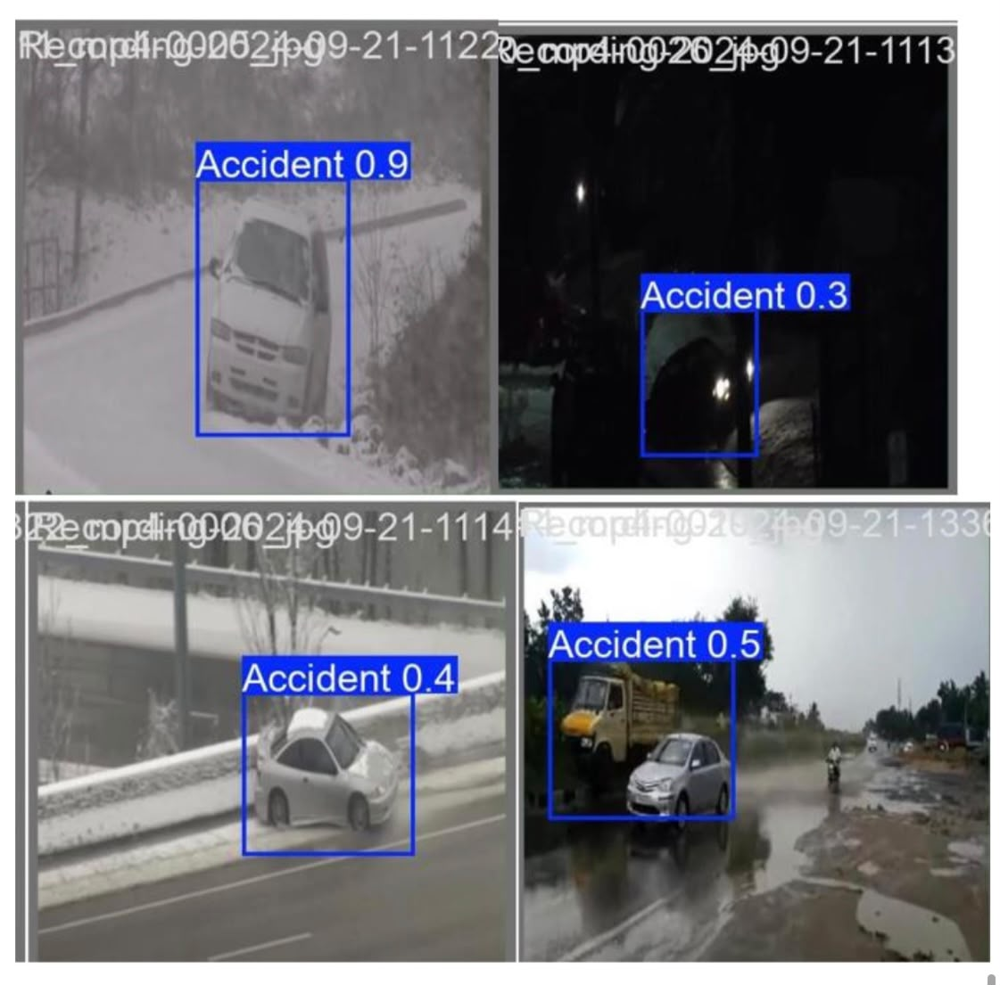
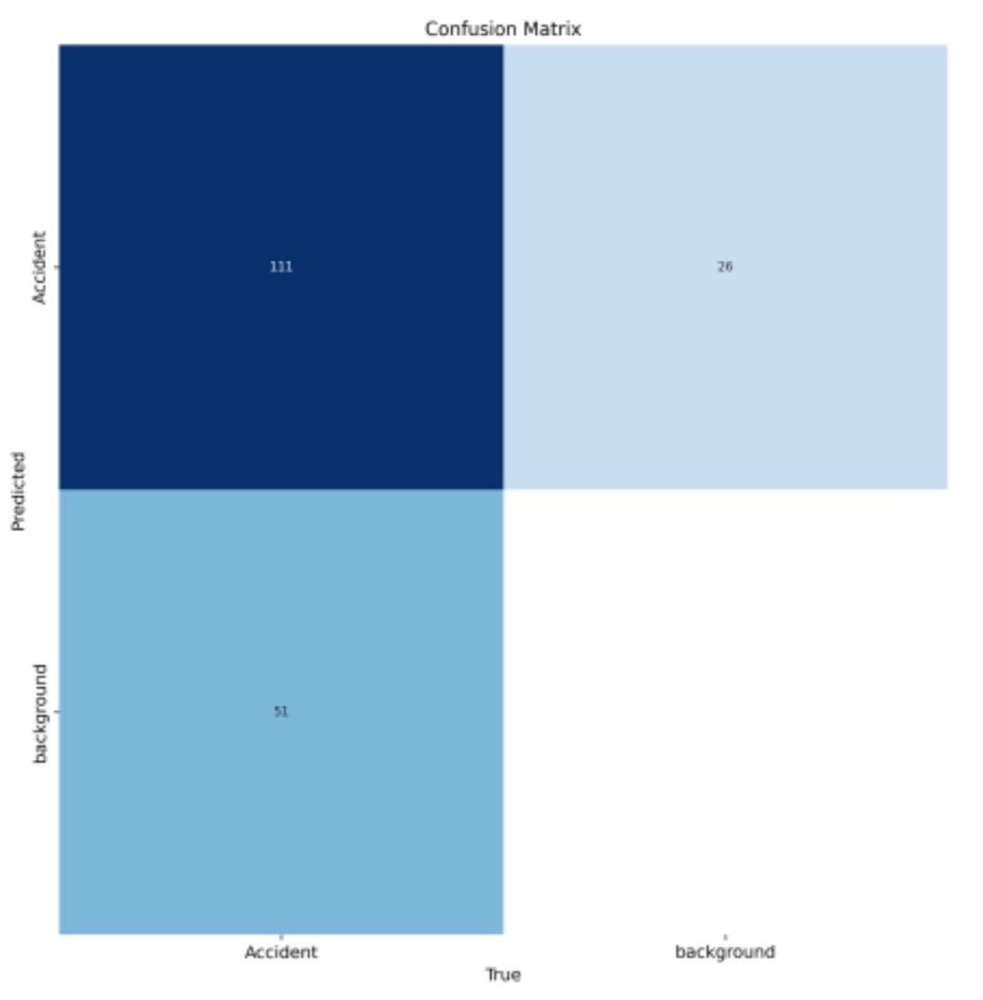
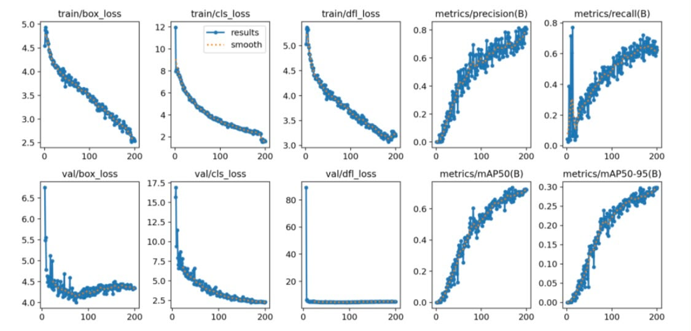

# 🚗 Automatic Vehicle Accident Detection from Images During Adverse Weather Conditions Using YOLOv10 and VGG19

> **Research Paper** | Computer Vision | Deep Learning | Road Safety


---

## 📄 Documentation

- **Research Paper:** [`Research_Paper.pdf`](./docs/Accidents_Detection_Research_Paper.pdf)
- **Dataset Information:** [`DATASET.md`](./dataset/DATASET.md)

---

## 📌 Overview

This research presents a **hybrid deep learning framework** for detecting **vehicle accidents under adverse weather conditions**, including rain, fog, snow, and low-light environments.

Poor visibility and environmental noise make accident detection particularly challenging for intelligent transportation systems. To address this problem, this work combines the strengths of **YOLOv10** for real-time object detection and **VGG19** for deep feature extraction and classification, improving accident detection accuracy while reducing false positives.

The proposed framework contributes to safer roads by supporting autonomous driving systems, traffic monitoring, and faster emergency response.

---

## 🔄 Proposed Framework

```
┌─────────────────────────────┐
│         Input Image         │
└─────────────────────────────┘
               │
               ▼
┌─────────────────────────────┐
│    Image Preprocessing      │
│ • Dehazing                  │
│ • Contrast Enhancement      │
└─────────────────────────────┘
               │
               ▼
┌─────────────────────────────┐
│          YOLOv10            │
│      Object Detection       │
└─────────────────────────────┘
               │
               ▼
┌─────────────────────────────┐
│ Detected Vehicle/Accident   │
│          Region             │
└─────────────────────────────┘
               │
               ▼
┌─────────────────────────────┐
│           VGG19             │
│       Classification        │
└─────────────────────────────┘
               │
               ▼
┌─────────────────────────────┐
│ Accident / Non-Accident     │
└─────────────────────────────┘

```

The proposed framework integrates image preprocessing, YOLOv10 object detection, and VGG19 classification to improve accident detection performance under adverse weather conditions.

---

## 🎯 Key Highlights

| Feature | Description |
|---------|-------------|
| **Dataset** | 3,480 annotated road images collected under different weather conditions |
| **Detection Model** | YOLOv10 |
| **Classification Model** | VGG19 |
| **Annotation Tool** | Roboflow |
| **Training Platform** | Google Colab |
| **Best YOLOv10 Precision** | **81.8%** (Epoch 200) |
| **Key Contribution** | Hybrid framework combining object detection and image classification |

---

## 🧠 Model Architecture

### YOLOv10
- Real-time object detection
- Fast single-stage detector
- Robust under adverse weather conditions
- Best precision achieved at **81.8%**

### YOLOv10 Performance

| Epoch | Precision | Recall | mAP@50 |
|------:|---------:|-------:|-------:|
| 50 | 54.2% | 45.7% | 44.6% |
| 100 | 63.2% | 56.8% | 62.9% |
| **200** | **81.8%** | **61.0%** | **72.5%** |

---

### VGG19

VGG19 was used to classify accident and non-accident images through deep feature extraction.

Compared with baseline CNN architectures, VGG19 consistently achieved the highest accuracy, precision, recall, and F1-score.

---

## 📈 Results

### Sample Prediction

<p align="center">
  
</p>

Example predictions produced by the YOLOv10 model for accident detection under different weather conditions.

---

### Confusion Matrix (Epoch 200)

<p align="center">
  
</p>

The confusion matrix illustrates the final classification performance of the best-performing YOLOv10 model.

---

### Training Curves

<p align="center">
  
</p>

Training curves showing model convergence and performance improvements over 200 training epochs.

---

## 🛠️ Technical Stack

| Category | Technology |
|----------|------------|
| Programming Language | Python |
| Detection Model | YOLOv10 |
| Classification Model | VGG19 |
| Frameworks | PyTorch, TensorFlow |
| Libraries | OpenCV, NumPy, Matplotlib, Scikit-learn |
| Annotation | Roboflow |
| Training Platform | Google Colab |

---

## 👩‍💻 My Contributions

As a **researcher and developer**, I participated in:

- Designing the hybrid deep learning framework.
- Collecting and annotating the dataset.
- Training and fine-tuning YOLOv10 and VGG19.
- Performing image preprocessing and data augmentation.
- Evaluating model performance using Precision, Recall, Accuracy, mAP, and F1-score.
- Analyzing experimental results.
- Writing the complete research paper.

---

## 🔮 Future Work

- Integrate LiDAR and radar data for multi-modal accident detection.
- Improve robustness under extreme weather conditions.
- Optimize the framework for deployment on edge devices.
- Evaluate newer object detection architectures such as YOLOv11 and YOLO-NAS.

---

## 🏆 Research Impact

This work demonstrates the effectiveness of combining **object detection** and **deep image classification** to improve vehicle accident detection under adverse weather conditions.

Potential applications include:

- 🚑 Intelligent emergency response systems
- 🚗 Autonomous driving
- 📹 Smart traffic surveillance
- 🌧️ Weather-aware road safety monitoring

---

## 📫 Contact

- **GitHub:** [YaraAlansari-CS](https://github.com/YaraAlansari-CS)
- **LinkedIn:** [Yara Alansari](https://www.linkedin.com/in/yara-alansari-64b17a317)
- **Email:** [yara.alansari01@gmail.com](mailto:yara.alansari01@gmail.com)

---

⭐ **If you found this research interesting, consider giving this repository a star!**
